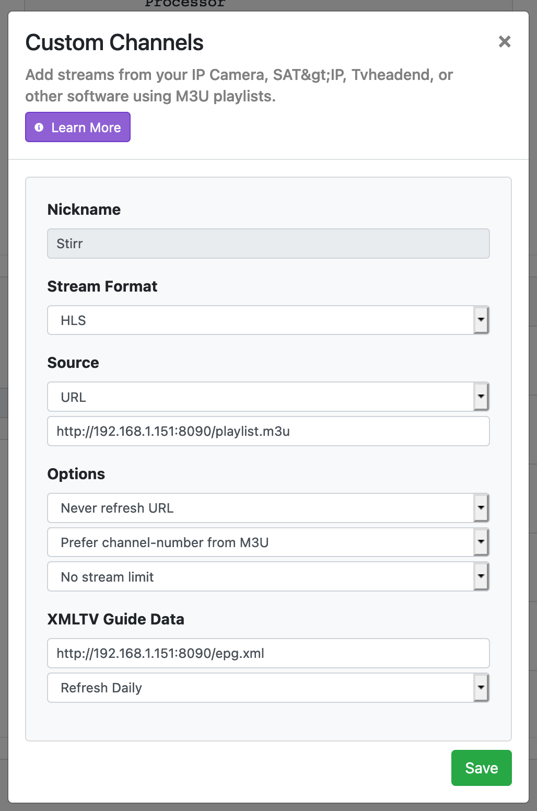

# Stirr for Channels

This simple Docker image will generate an M3U playlist and EPG optimized for use in [Channels](https://getchannels.com) and expose them over HTTP.

[Channels](https://getchannels.com) supports [custom channels](https://getchannels.com/docs/channels-dvr-server/how-to/custom-channels/) by utilizing streaming sources via M3U playlists.

[Channels](https://getchannels.com) allows for [additional extended metadata tags](https://getchannels.com/docs/channels-dvr-server/how-to/custom-channels/#channels-extensions) in M3U playlists that allow you to give it extra information and art to make the experience better. This project adds those extra tags to make things look great in Channels.

## Set Up

Running the container is easy. Fire up the container as usual. You can set which port it runs on.

    docker run -d --restart unless-stopped --name stirr-for-channels -p 8181:80 robbiet480/stirr-for-channels

By default, the service listens on port 80, but you can override it with the `PORT` environment variable.

Upon startup, the service will ask Stirr for your local station ID and use it for all future requests.
You can manually set a station ID by setting the `STIRR_STATION_ID` environment variable to something like `san-francisco`.

You can retrieve the playlist and EPG via the status page.

    http://127.0.0.1:8181

## Add Source to Channels

Once you have your Stirr M3U and EPG XML available, you can use it to [custom channels](https://getchannels.com/docs/channels-dvr-server/how-to/custom-channels/) channels in the [Channels](https://getchannels.com) app.

Add a new source in Channels DVR Server and choose `M3U Playlist`. Fill out the form using your new playlist and EPG URLs.

## Thanks

[@maddox](https://github.com/maddox) for building Channels and [Pluto For Channels](https://github.com/maddox/pluto-for-channels) which inspired this work.

## License

MIT
